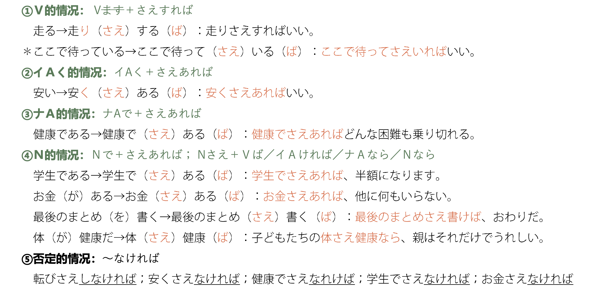
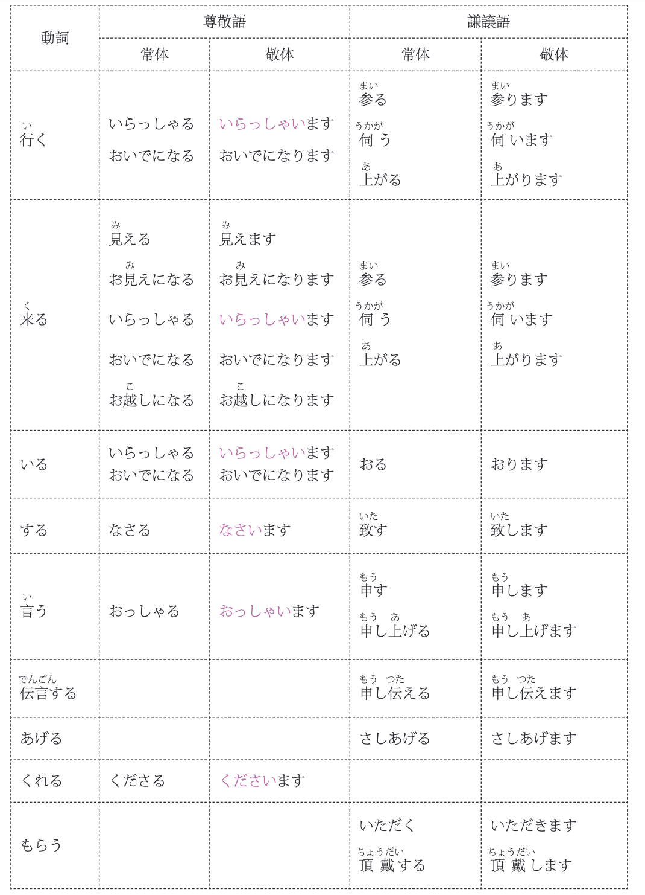
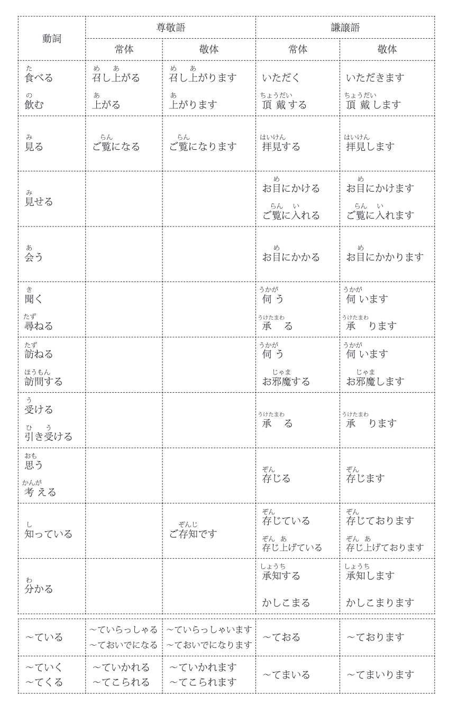

# につき

意义：在通知等文体中，用于阐述理由。
译文：“因为～”。**书面语**
接续：N＋につき

✿ 清掃中につき、お足元にご注意ください &#10140; 清扫中，请注意脚下

# を問わず

意义：用于想说明“いつでも・どこでも・だれでも”等的时候。前面经常接表示正反意义的名词或者包含程度差异的名词，如「男女／昼夜／有無／年齢／性別」等。
译文：“无论～；不管～；不问～（都...）”。**书面语**
单词：問：（とう）
接续：N＋を問わず  

✿ このスポーツセンターは、年齢を問わず、どなたでも利用できます。 &#10140; 任何年龄的人都可以使用这个体育中心。

# N＋に限って／に限り（书面语）／に限る

译文：表示限定，“只限于～；只有～”。**书面语**
接续：N＋に限って／に限り（书面语）／に限る　
单词：限る:（かぎる）

✿ 毎週火曜日に限って、映画は半額になります &#10140; 只有每周二，电影半价

# N＋に限って～ない

意义：用于发生了意料之外的坏事或者谣言时，对该事表示不能相信等强烈的否定时。
接续：N＋に限って～ない

✿ うちの子に限って、万引きなんてするはずがありません &#10140; 只有我的孩子不可能偷窃

# に応じ

意义：表示根据前项要求、变化、地区、情况、年龄、能力、经验等条件做...。 
译文：“根据～；按照～”。**书面语**
接续：N＋に応じて／に応じ／に応じたN
单词：応じ：（おうじる）

✿ 新年会はご予算に応じていろいろなコースがございます。 &#10140; 新年会根据预算有各种各样的路线。

# にかかわらず
意义：经常接表示正反意义的名词或词组，如「善悪／好き嫌い／いい悪い／するしない」等。
译文：表示“与～无关；不论～；不管～”。**书面语**
接续： N ／VるVない・Ｖるかどうか＋にかかわらず

✿ 区民センターの利用料金が変更になりました。和室は、人数にかかわらず、2時間1000円になります。 &#10140; 区民中心的使用费用变更了。和室，不论人数多少，都是2小时1000日元。

# において
意义：接在表示地点、时代、领域等词后面，
译文：表示“在～；在～方面”。**书面语**
接续：N＋において／における N （后面修饰名词）

✿ 入学式は、３階のホールにおいて行われます &#10140; 入学仪式在三楼大厅举行

# 際に

意义：表示“在～时候；借～时机”。用于说明书或介绍等。后面多跟“してください・必要です・お願いします”等表达。
译文：表示“在～时候；借～时机”。**书面语**
接续：Vる・Vた／Nの＋際（に）
补充：Vる／N＋に際して、“当～的时候；临～之际”，用于提醒、道歉、说明等句子中
单词：際：（さい）

✿ カードを紛失した際は、サービスセンターにご連絡ください。 &#10140; 丢失卡时，请联系服务中心。
✿ 各種書類の提出に際しては、期限を厳守してください。 &#10140; 提交各种文件时，请严格遵守期限

# こと
意义：用于说明规则或注意事项时。**书面语**
接续：Vる・Vない／Nの＋こと

✿ 願書は1月28日必着のこと。窓口での受付は行っておりません。 &#10140; 申请必须在1月28日提交。我们不在柜台办理登记手续。

# 以来
意义：用于想说“从～一直到现在一直保持着同样的状态”时。“～以来一直...”。
接续：Vて／N＋以来

✿ 母が入院して以来、家事はすべて私がしています。 &#10140; 自从妈妈住院以来，家务都是我做的。

# をはじめ

意义：用于举出一个有代表性的例子，表示其所属的集体每个成员都...之意。“以～为代表”。
接续：N＋をはじめ／をはじめとして／をはじめとするN

✿ 日本には富士山をはじめ、たくさんの美しい山がある。&#10140; 日本以富士山为首，有许多美丽的山。

# のもと

意义：用于想说“在某种影响力巨大的事物之下”时，如“教授のもと”。或者用于想说“在其条件或情况的范围内”时，如“協力のもと”。“在～之下”。书面语。
接续：N＋の＋もとで／もとに

✿ 最近は明るい太陽のもとで、元気に遊ぶ子どもが少なくなった。&#10140; 最近，在明媚的阳光下健康玩耍的孩子越来越少了。

# はもとより
意义：类似于“～はもちろん、...”“～だけでなく、そのほかにも...”。“～自不必说，...也”。**书面语，常用于演讲、展示等场合**
接续：N＋はもとより

✿ この温泉は、日本人はもとより、外国人にもたいへん人気があります。。&#10140; 这个温泉不仅在日本人中很受欢迎，在外国人中也很受欢迎。

# ものだ
意义：表示说话人断定谁都会那么想，绝对没错。有时也用来表示提醒、命令。让人听起来感觉很嚣张，所以最好不要对地位高的人说。口语“もんだ”。
接续：Vる／Vない＋ものだ

✿ 人が話しているときには、ちゃんと聞くもんだぞ。&#10140; 人说话的时候要好好听哦。

# 上で
意义：表示“为了做～，...很重要、很有必要”。**书面语。**
接续：Vる＋上で／上でのN

✿ 国際関係を考える上で、宗教問題は避けられない。&#10140; 考虑到国际关系，宗教问题不可避免。

# ながら
意义：连接内容相反的两个分句，表示转折关系。用于想说“虽然是～的状态，但是...”时。
接续： Vます／イAい／ナA／N＋ながら（も）

✿ 彼とは同じ寮に住んでいながら、ほとんど話をしたことがなかった。&#10140; 虽然和他住在同一个宿舍，但几乎没有说过话。

# N１＋を＋N２＋として

意义：用于想说“以A为B”时。
接续：N１＋を＋N２＋として／に（目的／中心／対象／手本／前提／...）

✿ 今回のシンポジウムは日本の伝統芸能をテーマとして行われます。&#10140; 本次研讨会以日本传统艺术为主题。

# をきっかけに
意义：用于表述当某事物开始或变化了的时候，成为其原因、理由的事情。“以～为契机”。
接续：N＋を＋きっかけ＋として／に

✿ 日本のドラマをきっかけとして、日本文化に関心を持つようになった。&#10140; 以日本电视剧为契机，对日本文化产生了兴趣。

# からには
意义：用于想表达“～是已经决定了的事情／事实，所以当然应该／要／去...”等强硬态度时。“既然～的话，就...”。
接续：普通形（ナAである／Nである）＋からには

✿ 日本での就職を希望するからには、しっかり企業研究をしておいたほうがいい。&#10140; 既然希望在日本就职，最好好好研究一下企业。

## 补充：普通形（ナAである／Nである）＋以上（は） 

✿ 市長になった以上は、皆様が安心して暮らせる街づくりをすることをお約束します。&#10140; 既然当上了市长，就承诺建设一个大家都能安心生活的街道。

# わけではありません
意义：用于“不是～的情况、心情、理由”等表达否定时。可以用于否定对方的想法或一般性判断。“并不是～；并没有～”。
接续：普通形（ナAな／Nの）＋わけではない 

✿ 退院しても、病気が完全に治ったわけではありませんから、無理をしないでください。&#10140; 即使出院了，病也不是完全好了，请不要勉强。

# ことなく
意义：用于在保持不做某事的情况下，后项动作继续进行或结束时。书面表达。
接续：Vる＋ことなく

✿ 今回は優勝することができましたが、これで満足することなく、さらに努力を続けます。&#10140; 这次我们赢得了冠军，但我们不会满足于此，我们将继续努力。

# にもかかわらず
意义：类似于～のに，表示从该状况预想到的和实际的不一样，后项多使用表达说话人吃惊、意外、不满、责难等语气的词。“虽然～，却...”。书面表达。尽管
接续：N／普通形（ナAである／Nである）＋にもかかわらず

✿ 彼の努力にもかかわらず、業績はよくならなかった。&#10140; 尽管他努力工作，成绩还是没有好转。

# として
表示资格、用途等。“作为～”。
接续：N＋として／としてのN

✿ 企業人としての自覚を持って行動してください&#10140; 请带着作为企业人的自觉行动

# 限る
用于想说在保持～状态期间不会发生变化。“只要～，就...”。 ２形容词、动词变形
接续：普通形（非过去式）（ナＡな・ナＡである／Ｎである）＋限り（は）

✿ ：高齢者でも、働ける限りは働きたいと思っている人が多い。&#10140; 即使是老年人，也有很多人只要能工作就想工作。

# せざるを得ない
用于想说“从当前情况来看，虽然不情愿但是不得不／只能...”时。书面语。
接续：Vない＋ざるを得ない（する→せざるを得ない）
不得不
✿ ：台風接近のため、野外コンサートは中止せざるを得なくなった。&#10140; 因台风接近，野外演唱会不得不中止。

# というものではない

用于委婉地表达某种主张或想法并不能说十分正确，或部分否定该主张或想法。“不能说～”。
接续：普通形＋というものではない 人は失敗から学ぶものだ ～ものではない

✿ ：勉強は今日やれば明日やらなくていいというものではない。&#10140; 学习不是今天做，明天不做。

# はともかく
用于想说“关于～目前先不考虑，先说一说其他方面”时。 
接续：N＋はともかく（として）；～かどうか／疑問詞か／Vるか＋はともかく（として）

✿ ：今の仕事は、給料はともかく、やりがいがあるいい仕事だと思っています&#10140;  我觉得现在的工作，薪水姑且不论，是很有意义的好工作

# かねない
用于想说“有可能陷入不好的状态”时。多用来表示“从客观来看”的判断。
接续：Vます＋かねない ～かもしれない

✿ ：今のような経営方法では、２、３年のうちに倒産しかねない。&#10140;  按照现在的经营方式，可能在两三年内破产。

# というより

用于想说“比起～这种说法，...更恰当”。“与其说是～，不如说是...”。
接续：普通形（ナA／N）＋というより

✿ この絵は絵というより、まるで写真のようだ。&#10140;  这幅画与其说像一幅画，不如说像一张照片。

# ではいられない

用于想说“无法持续～的状态”或“不能够做～的状态”。表示因为在紧迫的情况下，不能再
继续那种状态或者急于想付诸另一种行动之意。
接续：Vて／Nで＋（は）いられない 餃子の話になると、黙ってはいられない。

✿ B「この仕事は明日まで仕上げなきゃならないので、のんびり休んではいられないんですよ。」&#10140;  B: 这个工作要做到明天才能完成，所以不能悠闲地休息啊

# つつ
同～ながら，表示同时进行，“一边～一边...”。正式场合使用。
接续：Vます＋つつ／ながら

✿ 転んでけがをした足をかばいつつ走り続け、完走した鈴木選手に、観客から温かい拍手が送られた。&#10140;  
一边护着摔倒受伤的脚一边继续跑，跑完全程的铃木选手受到了观众的热烈掌声。

# にわたって
用来表示“时间或地点范围内全部”的意思。正式场合使用。
接续：N＋にわたって／にわたり ／にわたるN／にわたったN（有时间长度的名词）

✿ ：台風で電線が切れ、この町は全域にわたって、停電した。&#10140;  由于台风切断了电线，这个镇全境都停电了。

# N＋から＋N＋にかけて
从A到B之间，用于想说时间或地点的大致范围时。正式场合使用。
接续：N＋から＋N＋にかけて

✿ ：本日、九州から四国地方にかけて、梅雨入りしました。&#10140;  今天，从九州到四国地区，进入了梅雨季节。

# にともなって

用于想说“主要事情进展的同时还发生了其他事情”。也可以用来表示变化。正式场合使用。
接续：N＋にともなって／にともない／にともなうN

✿ 一人暮らしは自由だが、それにともない責任も生じる。&#10140;  一个人生活是自由的，但也有责任。

# おそれがある 
用于想说“有～的担心、危险、不安”时。正式场合使用。
接续：Vる・Vない／Nの＋おそれがある 

✿ ：噴火のおそれがありますので、避難してください。&#10140;  : 因为有喷发的危险，所以请避难。

# とともに
用于想说“和～一起；和～一样”时。也用来表示“和～一起产生／发生”或表示变化。正式场合使用。
接续：Vる／N＋とともに

✿ ：彼は医療ボランティアとして現地の医師とともに日夜病気の治療を行っている。&#10140;  他作为医疗志愿者与当地的医生日夜进行疾病的治疗。

# 次第
用于想说“（现在还做不到，但）～的话，就马上做...”时。 地獄の沙汰も金次第
接续：Vます／N＋次第

✿ ：ただ今、全線で運転を見合わせておりますが、情報が入り次第、お伝えいたします。&#10140;  现在全线暂停运行，我们将在收到消息后立即通知您。

# きり

后半句一般会出现表示预想到的该发生的事情没有发生，且这种没发生的状态持续不变的句子。“自从～就一直（没）...”。

接续：Vた＋きり／きりのN

✿ ：彼は「ごめん」と言ったきり、黙ってしまった&#10140;  他只说了一句“对不起”，就沉默了

①Vます＋きり 一直持续～的状态 ～に掛かり切り：专做这一件事
②数量词＋きり 相当于～だけ

# どころではない

用于想说明自己不是处于做~的状态（所以做不了）时，“根本不是做~的时候；根本没法儿~”。会话用语。 
Ｖる／Ｖている／Ｖた＋ところだ

接续：Vる／N＋どころではない

✿ 人が多くて、ゆっくり泳ぐどころじゃなかったよ &#10140;  人太多了，哪里能慢慢地游泳

# ものの

表示“虽说～这件事确属事实，但是实际上事情却不能按照预想的进行”。
接续：普通形（ナAな・ナAである／Nである）＋ものの

✿ この靴、デザインが気に入って買ったものの、履く機会が全然ないんだ。 &#10140;  我喜欢这些鞋子的设计所以我买了它们，但我从来没有机会穿它们。

# ことに

倒置用法，用来强调说话人的心情、感情时。“非常让人～的是，...”。
接续：Vた／イAい／ナAな＋ことに

✿ うれしいことに、うちの高校が合唱コンクールで優勝したんですよ。 &#10140;  令人高兴的是，我们高中在合唱比赛中获得了优胜。

# にしては

用于想说“和从～设想的情况不一样”时，一般用来评论、评价别人的事，所以很少用于自身评价。
接续：N／普通形（ナAである／Nである）＋にしては

✿ 今人気のエリナはモデルにしては背が高いほうではない &#10140;  现在很受欢迎的艾丽娜作为模特儿不算高

# ことか

用于有感情地描述自己到现在为止所做的或感受到的。常和「どんなに・どれだけ・どれほど」等词搭配用于自言自语。
接续：普通形（ナAな・ナAである／Nである）＋ことか

✿ 人は私のことを頭がいいと言うけど、この試験に合格するために、どれだけ 勉強したことか。私の努力は誰も知らないでしょうね。 &#10140;  人们都说我很聪明，为了通过这次考试，我不知道学了多少东西。没有人会知道我的努力，不是吗。

# N＋さえ＋～ば
表示只有～才是必要条件，此外什么都不需要。“只要～，就...”。

接续：N＋さえ＋～ば；Ｎで＋さえ＋あれば／なければ
Vます＋さえ＋すれば／しなければ；イAく／ナAで＋さえ＋あれば／なければ

✿ 残念だったね、さくらちゃん。転びさえしなければ1位だったのに &#10140;  真遗憾啊，小樱。只要不摔倒就排在第一位

# ようがない
在想要表达“想要那样做，但是没有那样做的手段或方法，所以做不了”时使用。
接续：Vます＋ようがない

✿ 出張の予定だったが、大雪で飛行機が欠航してしまったので 行きようがない。 &#10140;  原本打算出差，但是因为大雪飞机取消了，所以没办法去。

# あげく

用于想说“花了很长时间，做了很多事情，费尽辛苦之后，结果怎么样”时。常常用来说不好的结果。
接续：Vた＋あげく（に）

✿ 3時間以上迷ったあげく、店員に初めにすすめられたパソコンを買うことにした。  &#10140;  犹豫了3个多小时，最后决定买店员最开始推荐的电脑。

# ものではない

用于提醒“不能做～；不应该做～”时。 必要のない物だ。
接续：Vる＋ものではない

✿ 楽をしてお金をもうけようなんて考える もんじゃない。  &#10140;  不要想着轻松地赚钱。

# Vる＋だけ＋Vてみる

用于想说“可能会不行，但是要做做看”时。 できるだけ早く来てください。
接续：Vる＋だけ＋Vてみる
 尝试做做看 

 ✿ 今から行っても間に合わないかもしれないけど、行くだけ行ってみようよ。 もんじゃない。  &#10140;  现在去可能来不及了，但还是去看看吧。
 
 
# ばかりに

用于想说“仅仅只是因为～这样的原因，而导致了不好的结果，很可惜”时。
接续：普通形（ナAな・である／Nな・である）＋ばかりに

 ✿ 本当のことを言ったばかりに、彼を怒らせてしまった。 もんじゃない。  &#10140;  因为我说了实话，所以惹他生气了。

# ことはない
 用于想说“没必要做～；不做～也行”时。多用于提建议时。
接续：Vる＋ことはない

 ✿ ：君が謝ることはないよ。悪いのは向こうなんだから。   &#10140;  : 你不必道歉。因为错的是他们。

 # に比べて

 用于想将两个以上的事物进行比较，阐述程度不同时。“与～相比，...”。
接续：N＋に比べて／と比べて
 ✿ ：いちごはレモンに比べて、ビタミンCが多いんだって。ほんとかな？   &#10140;  和柠檬相比，草莓富含维生素 c。真的吗?

 # ものか

用于在自言自语是，想强烈表达自己“坚决不～”的心情时。有时也用来否定对方说过的话，“绝对不是～”。

接续：Vる／イAい／ナAな／Nな＋ものか／もんか（口语） 
 ✿ ：こんなサービスの悪い店には二度と来るもんか   &#10140; 我再也不会来这种服务差的店了

 # というものだ

用于说话人看到某个事实，对此发表断定式的感想、评论时。“这就是所谓的～；确实是～”。含有“一般人都会觉得～的吧”的意思。
接续：普通形（ナA／ N）＋というものだ
 ✿ 優勝！？それは期待しすぎというものだろう   &#10140; 冠军? 这也太期待了吧

 # ば＋こそ
用于想强调理由时，表示“正是因为～”的意思。同「～からこそ」。
接续：Vば／イＡければ／ナAであれば／Nであれば＋こそ

 ✿ この山の自然を愛すればこそ、観光客の数を厳しく制限しているのです。   &#10140;正因为热爱这座山的自然风光，才会严格限制游客的数量。

# ない＋ことはない

表示“也不是不～”。用于没有底气，不想把话说得很绝对的时候。
接续：Vない／イAくない／ナAでない＋ことはない 

 ✿ そんなに好きではありませんが、飲めないことはありません   &#10140; 我不是很喜欢，但也不是不能喝

 # V能动态＋だけ
用于想说“做～做到极限”。
接续：V能动态＋だけ；
 ✿ ：春節を前にリンさんはお土産を持てるだけ持って、帰国した。   &#10140; 春节前夕，小林带着能带多少礼物就带多少回国了。

 # 普通形＋もの
较为通俗的口语用语。接在句子末尾处，用于想解释理由或阐述借口时。常采用「だって～んだもん」的形式，有种撒娇的语气。
接续：普通形＋もの

 ✿ だって、この人形もこのお菓子も日本じゃなきゃ、買えないんだもん。   &#10140; 因为这个人偶和这个点心都不是日本的话就买不到了。

 # わけにはいかない
用于想说“出于某种理由不能～，不可以～”。
接续：Vる／Vない＋わけにはいかない

 ✿ でも、午後から大事な会議があるから、帰るわけにはいかなくて...。   &#10140; 但是，下午有重要的会议，不能回去

 # のみ

用于想说“只有”时。书面语，经常出现在通知等文体中。だけ
接续：Vる／N＋のみ
 ✿ お薬のみご希望の方は、こちらの箱に診察券をお入れください。   &#10140; 只想吃药的人，请在这个箱子里放入诊察券。

 # つもり
 表示虽然事实或实际行动的结果不是那样，但有那样的意图之意。“就当是～”。
接续：Vた／イAい／ナAな／Nの＋つもりだ 

 ✿ ：旅行に行ったつもりで、この「列車の旅」のDVDを見て、楽しみましょう   &#10140;  就当是去旅行了，看看这个“列车之旅”的DVD，好好享受吧

 # から見る

用于想阐述从～的立场、视点、依据材料出发考虑的事情时。“从～来看”。
接续：N＋から見ると／から見れば／から見て
 ✿ ：便利さという点から見ると、やはり田舎より都会のほうが暮らしやすい。   &#10140;  从便利这一点来看，还是城市比乡村更适合生活。

 # 一方

 用于说明关于同一件事物的情况大不相同。“一方面～，另一方面...”。正式场合使用。
接续：普通形（ナAな・ナAである／Nの・Nである）＋一方（で）
 ✿ ：仕事を求めて都会に出る若者がいる一方、故郷に戻って就職する若者もいる   &#10140;  一方面有年轻人为了找工作进城，另一方面也有年轻人回到家乡工作

 # ことから

用于陈述事物名称的由来、或者判断某事的依据等。
接续：普通形（ナAな・ナAである／Nである）＋ことから
 ✿ ：このサツマイモは中が赤いことから、紅イモと呼ばれています。   &#10140;  : 这个红薯因为里面是红色的，所以被称为红薯。

 # のみならず
 相当于“～だけでなく”。“不仅～”。正式场合使用。
接续：普通形（ナAである／N(である)）＋のみならず
 ✿ ：現在、日本のコンビニは若者のみならず、あらゆる世代の人々に様々な目的で利用されて   &#10140;   现在，日本的便利店不仅被年轻人使用，也被所有年龄层的人以各种各样的目的使用

# といった
用于举例说明，类似于など，“～等”。
接续：N＋といったN
 ✿ ：クルミやアーモンドといったナッツ類を毎日食べると、記憶力がよくなるそうで   &#10140;   每天吃核桃、杏仁等坚果类食品，记忆力会变好

# にしたがって
表示如果前项变化的话，后项也会跟着变化。前后项都使用表示变化的词语。“随着～”。
还可以表示按照、配合前项做后项。“按照～；遵循～”。正式场合使用。
接续：Vる／N＋にしたがって／にしたがい 

 ✿ ：暑くなるにしたがって、体調を崩す人が増えた。   &#10140;   随着天气变热，身体不适的人增加了。

 # 得る
 用于想说“能够／有可能～”时。常和「考える・想像する・ある・知る・予測する・理解する」等词搭配使用。经常出现在论文等文体中。
接续：Vます＋得る（うる・える）／得ない（えない）
 ✿ ：凶器がどこにあるか、考えうる場所はすべて捜したが、まったく手がかりがつかめなかっ   &#10140;   ：凶器在哪儿，能想到的地方我都找遍了，就是找不到线索

 # に反して
和「予想・期待・意向」等词搭配使用，表示“结果或状态与预想的或期待的完全相反”。书面表达。
接续：N＋に反して／に反し／ に反するN／に反したN
 ✿ ：今回の経済政策は国民の期待に反して、まったく効果がなかった。   &#10140;   ：这次的经济政策与国民的期待相反，完全没有效果。

 # に関して
 用于想阐述话题对象或调查的内容时。经常出现在调查、研究、通知等文体当中。
接续：N＋に関して／に関するN 
 ✿ ：修理に関するお問い合わせはサービスセンターまでお電話かメールでご連絡くだ   &#10140;   ：有关修理的咨询请致电服务中心或通过邮件联系

# 反面
陈述一件事的两个相反的倾向、性质。在陈述更为对立的事时，汉字多使用「反面」。
接续：普通形（ナAな・ナAである／Nである）＋反面／半面 
✿ ：来日前は留学に期待する反面、不安も大きかった。   &#10140;   ：来日本之前对留学抱有期待，但另一方面也有很大的不安。

# 上（じょう）
和「理論・職業・教育・法律・歴史・表面」等表示视点的词语一起使用，表示“在～上”。
接续：N＋上（じょう）
✿ ：お札にはその国の歴史上の人物の顔が描かれていることが多い   &#10140;   ：纸币上多描绘该国历史人物的面孔

# つつある
事物正向某个方向前进之意。特别是在想要确切地表达正在进行过程中之意时，使用此句型。书面表达。
接续：Vます＋つつある 食べている 

✿ ：異常気象の影響が世界各地に広がりつつある。   &#10140;   ：异常气象的影响正在世界各地蔓延。

# に限らず
用于想说“不仅～，（其他还有）”时。书面表达。
接续：N＋に限らず
✿ ：環境対策のためにも、夏に限らず、年間を通して節電を心がけるべきだ。   &#10140;   为了环境对策，不仅是夏天，全年都要注意节电。

# ば＋と思う
用于礼貌地表达“如果可以的话，希望～”的意思。
接续：Vば／イAければ／ナAであれば＋と思う
✿ ：こちらの事情をご理解いただければと思います。   &#10140;   : 希望您能理解这里的情况。

# につきまして
について的更有礼貌的表达方式。

✿ ：発売の時期につきましては、現在検討中でございます。   &#10140;   : : 关于发售的时期，现在正在讨论中。

**について的更有礼貌的表达方式。**
について⇔につく ＋まして：につきまして
に関して⇔に関する＋まして：に関しまして
にとって⇔にとる ＋まして：にとりまして
において⇔におく ＋まして：におきまして
として ⇔とする／といたす＋まして：としまして／といたしまして

# 敬语

## 丁寧語

礼貌语，又叫郑重语，通过用郑重的语气说话来表示对听话人的敬意。主要靠出现在句末的助动词表示。根据句末助动词所表达的郑重语气的程度，礼貌语的句子可以分为：

1. 一般敬体：用です／ます结尾 例：私は山田です。我是山田。
2. 特敬体 ：用ございます结尾 例：私は山田でございます。我是山田。

一般敬体的です・ます我们已经了解，接下来主要对特敬体的ございます来做一个介绍。

ござる：ある的郑重语，能力考范围内需要掌握的用法如下：

1. N が／に ＋ござる⇔ N が／に ＋ある / 表示事物的存在
2. N で／ナ A で＋ござる⇔ N で／ナ A で＋ある/ である的郑重表达

✿ トイレは階段の近くにございます &#10140;   厕所在楼梯附近

## 此外

我们经常还会看到有些词汇前面会接上一个お或者ご，这是一种礼貌、优雅地来描述事物的表达方式，称之为美化語（びかご），有的语法书中也会将美化語划分在丁寧語的范畴。

**お：多加在日语固有词汇前；**
**ご：多加在汉语词汇前。（另，日常生活吃穿物品多用お）**

## 敬語

根据说话内容涉及对象的不同，敬语可以分为**尊敬語**（そんけいご）和**謙譲語**（けんじょうご）。

### 尊敬語（そんけいご）：尊他语 - 提到对方的行为、状态及有关事物时使用。

#### 称呼对方时用的尊他表达 - 给称呼加上表示尊敬的前缀或者后缀
例：～さん 
#### 提到对方动作的时候 - 使用该动词对应的尊他动词

| 动词             | 尊他动词                   | 敬体表达         |
| ---------------- | -------------------------- | ---------------- |
| 行く・来る・いる | いらっしゃる               | いらっしゃいます |
| 行く・来る・いる | おいでになる               | おいでになります |
| 言う             | おっしゃる                 | おっしゃいます   |
| 食べる・飲む     | 召し上がる（めしあがる）   | 召し上がります   |
| 見る             | ご覧になる（ごらんになる） | ご覧になります   |
| する             | なさる                     | なさいます       |
| くれる           | くださる                   | くださいます     |

例： 山田さん、ご飯を召し上がりますか。（敬语，尊他）

在敬语动词表中，いらっしゃる这个词除了单纯表达行く・来る・いる的意思，还有以下用法是能力考范围内需要掌握的：

1. V て ＋いらっしゃる：V て ＋いる  ている的尊他表达
2. N で／ナ A で ＋いらっしゃる：N で／ナ A で ＋ある  である的尊他表达

✿ お仕事は何をしていらっしゃいますか。（相当于：何をしていますか） &#10140;   您在做什么工作。

关于である的尊他表达「でいらっしゃる」和郑重表达「でござる」：

1. こちらは山田先生のお母様です。→こちらは山田先生のお母様でいらっしゃいます。
2. 
这位是山田老师的母亲。
1. こちらは図書館です。 →こちらは図書館でございます。
这边是图书馆。

例句 1 讲的是山田老师的母亲，提到她的事情，为了表示对她的尊敬，这个句子应该选用敬语中的尊他表达；
例句 2 讲的是图书馆，我们没有必要对图书馆表示尊敬，而是会需要对听话人表示尊敬，这时候就会使用郑重语，通过用郑重的语气说话来表示对听话人的敬意。

#### 提到对方动作的时候 - 没有对应尊他动词的情况：将动词替换成对应的尊他句型

1. お＋ V Iます／ V IIます ＋です／になる／なさる
2. ご＋サ变动词词干 ＋です／になる／なさる
3. 
**例：**
社長は今日の会議にご欠席です。社长会缺席今天的会议。 （相当于：欠席します）

山田さん、保険証をお持ちですか。山田先生，您有保险证吗？（相当于：持っています）

先週はご出張でしたか。您上周出差了吗。 （相当于：出張しました）

ペットをお連れの方は、入店をご遠慮ください。 （相当于：連れてきたＮ）
带着宠物的大家请不要进店。

もうお帰りになりますか。您就要回去了吗？ （相当于：帰ります）

部長はこの報告はまだお読みになっていません。 （相当于：読んでいない）
部长还没有看这份报告。

入場券はこちらでお求めになれます。入场券可以在这边购买。（相当于：求められます）

これは山田先生がお書きになった日本語文法の本です。 （相当于：書いたＮ）
这是山田老师写的日语语法书。

先生は、今何についてご研究なさいますか。 （相当于：研究しています）
老师您现在在研究什么方向呢？

ご注文なさった品物の件についてお電話いたしました。 （相当于：注文したＮ）
关于您订购的商品给您打了电话。

#### 敬语助动词れる／られる（接续同被动助动词れる／られる，相对于尊他句型来说敬意程度低一些）

きのう、山田先生が来られて、教えてくださいました。（相当于：来て）
昨天山田老师来了之后告诉我了。

②謙譲語（けんじょうご）：自谦语 - 以谦逊的态度叙述自己或己方的行为、状态及有关事物时使用。

**a. 在向对方提到自己和己方时用的自谦表达 - 给自称加上表示自谦的前缀**
**b. 谈到自己或己方动作的时候 - 使用该动词对应的自谦动词**

| 动词                 | 自谦动词       | 敬体表达     |
| -------------------- | -------------- | ------------ |
| 行く・来る           | 参る（まいる） | 参ります     |
| いる                 | おる           | おります     |
| 言う                 | 申す（もうす） | 申します     |
| する                 | いたす         | いたします   |
| 食べる・飲む・もらう | いただく       | いただきます |

**b. 谈到自己或己方动作的时候 - 没有对应自谦动词的情况：将动词替换成对应的自谦句型**

1. お＋ V Iます／ V IIます ＋する・いたす／申し上げる
2. ご＋サ变动词词干 ＋する・いたす／申し上げる

例：お荷物、お預かりします／お預かりいたします。我来保管您的行李。（相当于：預かります）\

注：申し上げる本是言う的自谦语，「お／ご～申し上げる」句型的使用范围比较小，一般用于「お願い申し上げます（拜托您）、お詫び申し上げます（向您道歉）、お礼を申し上げます（向您道谢）」等当说话人要对对方进行某种言语活动时使用。单纯言语活动的自谦用申す即可。另外，表示为对方传话，带口信则用申し伝える。

③不同场景可以使用的敬语句型
**a. 授受表达**
１、物品的授受 A は B に N を あげる／くれる／もらう→敬语 A は B に N を さしあげる／くださる／いただく
２、行为的授受 A は B に V て あげる／くれる／もらう
 →敬语１ A は B に V て さしあげる／くださる／いただく
 →敬语２ お／ご～くださる／いただく（相比敬语 1 来说语气更显尊敬）

例：この人形は部長の奥様にさしあげようと思って買いました。（あげよう）
这个玩偶是我买来想送给部长夫人的。
卒業のとき、山田先生は息子に本をくださいました。（くれた）
毕业的时候，山田老师送了本书给我儿子。
私は先生にいい本をいただいた。（もらった）
我从老师那儿得了本好书。
本日はお忙しい中、お集まりくださり、たいへん感謝しております。（集まってくれて）
十分感谢大家今天在百忙之中聚集于此。
本日はお忙しい中、お集まりいただき、たいへん感謝しております。（集まってもらって）
十分感谢大家今天在百忙之中聚集于此。
おいでくださるときは、ご連絡いただければと思います。（来てくれる）
您来我们这儿的时候，可以先联系一下我们。
＊お越しになる／おいでになる／ご覧になる → お越し／おいで／ご覧＋くださる／いただく

**b. 说话人请求对方做某事**

1. お＋ V Iます／ V IIます ＋ください／願う
2. ご＋サ变动词词干 ＋ください／願う

ぜひお越しください。请一定要来。（来てください）

**c. 说话人征求对方允许自己做某事**

1. V（さ）せてくださる
2. V（さ）せていただく

例：具合が悪いから、先生は休ませてくださいました。（休ませてくれました）

## 敬语动词变形规则

# のなんのって

表示简直无法用语言来形容的“非常～”的意思。一般用于口语表达。
接续：简体句子（ナAな／Nだ）＋のなんのって

✿ 午前中、忙しかったのなんのって、トイレに行くひまもないくらいだった。&#10140; 上午忙得连上厕所的时间都没有。

# たて

表示动作刚完的状态，常和「作る、できる、焼く、炊く、なる」等动词搭配使用。
接续：Vます＋たて／たてのＮ

✿ 炊きたてのご飯ってほんといいね。何杯でも食べられそう。&#10140; 刚煮好的饭真好啊。好像可以吃几杯。

# ったら

多接在指人名词的后面表示说话人对该人物的轻微不满，后续的内容是对该人物的负面评价，
有时后半句会省略。用于比较随便的口语场合，多为女性使用。“～这个人呀，真是的，...”。
接续：N＋ったら
✿ うちの犬ったら、私が浴衣着ていたら、よその人と間違えてほえたのよ。&#10140; 我家的狗啊，我穿着浴衣的时候，误以为是外人而吠叫。

# ようになっている

用于说明机器系统或身体构造等受到什么作用或发生什么情况后，自动引发后面的事情。
接续：Vる／Vない＋ようになっている
✿ ほこりが鼻に入るとくしゃみが出て、自然にそれを外へ出すようになっています。&#10140; 灰尘一进入鼻子就会打喷嚏，自然地把它弄出去。

# わけだ
表示从某种事实、情况看来，“理所当然得到～的结论”之意。用于明白了之前琢磨的事情的原因，并表示“果然如此；原来如此”时。“难怪～”。
接续：普通形（ナAな／Nの）＋わけだ／というわけだ
✿ え！本当？じゃあ、おいしいわけよね。&#10140; 真的吗? 那就是好吃了。

# どころか

表示“别说～了，（就连...都）”。～的部分常常为对方说的话或自己一开始以为的事情等。
接续：普通形（ナA／N）＋どころか
✿ ううん。雨に降られて、暑いどころかすごく寒くて、風邪ひきそうだったよ。&#10140; 不是。被雨淋了，别说是热了，反而特别冷，好像要感冒了。

# ようじゃ
表示批评，“继续现在这种状态的话，不会有好结果的”。
接续：Vる／Vない＋ようでは／ようじゃ ないと～ない
✿ おしゃれに全然気を使わないようじゃ、社会人としてまずいんじゃない？&#10140; 完全不注意打扮的话，作为社会人不是很糟糕吗？

# ようなら
表示观察当下的状态、情况之后再提出前项作为话题。相当于なら／だったら的更加客气、礼貌的说法。
接续：普通形（ナAな／Nの）＋ようなら／ようでしたら／ようだったら
✿ 熱が下がらないようだったら病院に行ったほうがいいですよ。&#10140; 如果你的烧没有退，你最好去医院。

# ぶる
表示其实不是那样，却要显得那样。常和「優等生・悪者・大人・上品・いい子・偉い」等词汇搭配使用。“装作～的样子；摆出～的架子”。
接续：N／イA／ナA＋ぶる 
✿ ：たとえかっこいい人の前でも、お嬢様ぶるなんて、私には無理だ。&#10140; 即使在帅气的人面前，装大小姐的样子，我也做不到。

# に限って
用于想批评说“～立场的人一般都有...的倾向”时。
接续：N＋に限って
✿ ：よく知らないやつに限って、偉そうなことを言う。&#10140; : 只有不知道的人才会说大话。

# ことだ 
表示说话人的判断，“应该～；最好是～”。常常用于提建议。
接续：Vる／Vない＋ことだ 
✿ ：仕事でも何でも自分一人で悩まないで、誰かに相談することですよ。&#10140; : 工作上什么都不要自己一个人烦恼，找人商量。

# という
前后接同一个词语表示“全部的～”。
接续：N＋という＋N
✿ 今回の森林火災で、この辺の 木という木 は、1本残らず燃えてしまった。&#10140; 在这次森林大火中，这附近所有的树木都被烧毁了

# ところだった
用于想说“眼看就要变成～的状况了，其实没有变成那样”时。“差一点儿就～了”。
接续：Vる／Vない＋ところだった
✿ 今朝は30分も寝坊しちゃって、危うく遅刻するところだったよ。&#10140; 今天早上我睡过头了三十分钟，差点就迟到了。

# くらいなら
用于想说“因为不喜欢A，所以虽然B也谈不上最好但是还是选B”时。“与其～不如...”。也可以用于表示后悔的时候，“早知道～的话，不如...”。

接续：Vる＋くらいなら
✿ 15,000円も払うくらいなら、新しいのを買ったほうがいいね。&#10140; 与其花15000日元，不如买个新的。

# ましだ

用于想说“和其他相比，虽然谈不上好，但也不是最差”时。
常用搭配：「Ｂより、Ａのほうが（まだ／ずっと）ましだ」「Ａだけましだ」。

✿ 暑いより、寒いほうが（まだ／ずっと）ましだよ。寒いときには服を着ればいいんだから。&#10140; 与其热，不如冷。天冷的时候穿衣服就行了。

# ものがある
表示说话人由某个事实而感觉到的、或带着感情去描述某事物的特征。前面多接表现说话人感情的词句且一般为现在时。常用「～には～ものがある」。“有～的一面”，“的确很～”。

接续：普通形（ナAな／Nだ）＋ものがある
✿ 世界中で大ヒットした歌には、世代を超えて人々の心に響くものがある。&#10140; 在全世界都大受欢迎的歌曲中，有超越世代影响人们内心的东西。

# まい

表示否定的推测。“不会～吧；～的可能性非常少吧”。相当于「～ないだろう」。书面用语。
接续：Vる＋まい（另有：VIIます＋まい； くる→きまい／こまい；する→しまい／すまい）

✿ 世界経済は状況から見て、すぐに好転することはあるまい。ないだろう&#10140; 从目前的情况来看，世界经济不会很快好转。不会吧

补充：～まい（接续同上）还可以表示否定的意志。“绝对不要做～”。
✿ 有名レストランへ行ったが、そのサービスの悪さに二度と行くまいと思った。&#10140; 我去了一家著名的餐馆，但是由于服务质量差，我再也不去了。

# につけて

用于想说“每当见到或听到～这件事时，总会变成后面的某种心情”。
接续：Vる＋につけ／につけて

✿ 電車の中で走り回る子どもたちを見るにつけ、「家庭でしっかりしつけをしろ」と言いたくなる&#10140; 每当看到孩子们在火车上跑来跑去，我就想对他们说: “在家里好好管教他们

# わりに（は）
表示从～上考虑的话应该达到某种程度，但后项事实却与其不符。
接续：普通形（ナAな／Nの）＋わりに（は）
✿ この料理は簡単なわりに豪華に見えるので来客のときによく作るんです。&#10140; 这道菜虽然简单，但看起来很豪华，所以经常在来客的时候做

# かのうちに

表示前项动作还没有彻底结束的短时间内发生了后项。
接续：Vる／Vた＋か＋Vない＋かのうちに（同一动词）
✿ 早食い選手権を見ていたら、選手たちは食べ物を口に入れたか入れないかのうちに、次の料理に手を伸ばしていた。&#10140; 看着快食锦标赛，选手们刚把食物放进嘴里，就把手伸向下一道菜。

# げ
用于表述看见之后感受到的印象，经常和表示心情的词语「さびしい・悲しい・楽しい・不安・得意・満足・～たい」等一起使用。类似于そうだ表示样态的用法。

接续：A词干＋げ→做二类形容词使用

✿ ：プロジェクトメンバーは、誇らしげな表情で成功したことを報告した。&#10140; : 项目成员自豪地报告了他们的成功。

# やら
不完全列举的用法，表示除此之外还有很多，但是先举出一、两个例子来说明。多用来表示因为有各种各样的东西或情绪等而整理不清的心情。
接续：Vる／イAい／N＋やら
✿ ：部屋代やら、交通費やら、日本はとにかくお金がかかる。&#10140; : 房租啦，交通费啦，日本总之是要花钱的。

# かと思うと
表示前项刚一发生，后项就紧跟着发生了。用于强调说明情况急剧变化，不用于讲自己的事情。
接续：Vた＋（か）と思うと／（か）と思ったら／かと思えば
✿ ：青空を飛んでいた鳥は突然海に潜ったかと思うと、魚を口にくわえて出てきた。&#10140; 在蓝天上飞翔的鸟突然潜入海中，然后叼着鱼出来了。

# にほかならない
在断言“绝对是～；绝不是～以外的任何事物”时使用本句型。通常出现在评论性的文章中，为书面语。
接续：N＋にほかならない
✿ ：今回のプロジェクトの成功は、チームワークの勝利にほかなりません。&#10140; : 这次项目的成功无异于团队合作的胜利。

# にすぎない
陈述“不超过某一程度，程度不过如此”，强调其程度之低。
接续：Vる・Vた／N＋にすぎない
✿ ：この高校は2年前に男女共学になったが、男子学生はまだ10人にすぎない。&#10140; 这所高中在两年前实行了男女同校，但是男生还只有10人。

# 上（に）
表示添加，累加。“不仅～，而且...”。前后项是同一性质，即同为积极因素或消极因素。
接续：普通形（ナAな・である／Nである）＋上（に）
✿ ：先週は熱が40度も出た上に、下痢が止まらず、本当に大変でした。&#10140; 上周发烧40度，而且腹泻不止，真的很难受。

# といっても
用于就对方想象的情况来表达“其实不是那样”的意思。“虽说～，实际上...”。用来说明某事物的实际样态。
接续：N／普通形＋といっても／といいましても
✿ ：1世帯といっても、一人暮らしの人から10人以上の大家族までいろいろある。&#10140; 即使是一个家庭，从独居的人到10人以上的大家庭都有。

# に限る
表示说话人主观地认为“～是最好的”。
接续：Vる・Vない／N＋に限る
✿ ：運動の後は、はちみつとレモンのジュースに限る。&#10140; 运动后最好喝蜂蜜和柠檬汁。

# だけあって
感慨其才能、努力、地位、经验等名不虚传，对其进行赞扬时的表达方式。后接对其结果、能力及特征予以评价的词语。常和「さすが」一起使用。“与～相称；不愧是～；到底没白～”。

接续：N／普通形（ナＡな）＋だけあって／だけに
✿ ：この町は文化遺産に登録されているだけあって、住民の環境保護に対する意識も高い。&#10140; 这个城市正因为被登录为文化遗产，居民的环境保护意识也很高。

# にしろ
用于例举某范围内的事物然后说“～也好～也好，不论哪个都...”。
接续：普通形（ナA・ナAである／N・Nである）＋にしろ／にしても／にせよ（书面）
✿ ：東京にしろ大阪にしろ大都市には働く場所が多いので人が集まってくる。&#10140; 无论是东京还是大阪，大城市的工作场所很多，所以人很多。

# とか
用于想说听到的信息时，多用于表示“確かな情報ではないが、～とか言っていた”。
接续：普通形＋とか
✿ ：息子さんが今度結婚なさるとか。おめでとうございます。&#10140; 儿子下次要结婚了。恭喜你。

# にそって
表示“沿着～；按照～”，常和「マニュアル・方針・案内・道順」等词搭配使用。
接续：N＋にそって／ にそうN／にそったN
✿ ：2人は夕暮れの道を川にそって歩き続けた。&#10140; 两人沿着河边走在黄昏的路上。

# にかけては
表示“在～领域，是水平最高的、最有自信的”。 
接续：N＋にかけては
✿ ：日本酒作りにかけては彼の右に出る者はいない。&#10140; 在酿造日本酒方面没有人能比得上他。

# ない＋ことには

用于想说“不～的话，就不能...；不～的话就不知道”时。 走りきる
接续：Vない＋ことには；Nがない＋ことには
✿ 田舎では、車がないことには生活できない。&#10140; 在农村，没有汽车就不能生活。

# がち
用于想说动不动就容易产生某种倾向。“往往会～；容易会～”。常和「忘れる・病気・休む・思う・考える・心配する・留守」等搭配使用，多用于不好的方面。也可以组成表示状态、样子的惯用表达方式。
接续：Vます／N＋がち 按II类形容词活用
✿ ：日本人は自分の意思をはっきり言わないので誤解されがちだ。&#10140; 日本人不明确表达自己的意思，容易被误解。

# つつ（も）

表示逆接，“虽然～，但还是（做了不好的事情）”。常用于说话人的后悔、坦白等。
接续：Vます＋つつ（も）
✿ ：チョコレートを食べたらにきびが増えると知りつつも、つい手が伸びてしまうんです。&#10140; 虽然知道吃巧克力会增加粉刺，但还是忍不住伸手去拿。

# としたら
表示“如果假定～的话，...”，用于想说自己的意见或设想时。
接续：普通形＋としたら／とすると／とすれば
✿ ：もし、生まれ変われるとしたら、私は鳥になりたい。&#10140; 如果我能重生，我想成为一只鸟。

# 次第で
用于表示事情发展的结果取决于该名词所表示的情况或状态。“按照～、根据～；全凭～、全看～、视～而定”。
接续：N＋次第で／次第だ 本人の気持ち次第。
✿ ：登山ルートは天候次第で変更する場合もありますので、ご了承ください。&#10140; 登山路线可能会因天气情况而有所变更，敬请谅解。

# 一方だ
前接表示变化的动词。表示状态等朝一个方向不断发展。“不断～；越来越～”。
接续：Vる＋一方だ
✿ ：ここは静かな町だったのに、テレビで紹介されて以来、観光客が増える一方だ。&#10140; 这是一个安静的小镇，但自从电视上介绍它以来，游客越来越多。

# に先立って
表示“在～之前，做...”。书面表达。
接续：N＋に先立って／に先立ち／に先立つN
✿ ：レストランの開店に先立って、試食会が開かれた。&#10140; 在餐厅开业之前，举行了一次品尝会。

# 上（で）
同“Vてから”，“做～之后”。正式场合使用。
接续：Vた／Nの＋上（で）／上（で）のN
✿ ：駅前の再開発については、住民の皆さんの意見をまとめた上で、市に要望書を提出し&#10140; 关于车站前的再开发，总结了各位居民的意见之后，向市政府提出请求书,

# にこたえて

接在表期待、愿望、提问等名词之后，表达“按照对方的期待或要求行事”。常和「期待・要望・要請・アンコール・声援・声」等词搭配使用。
接续：N＋にこたえて／にこたえたN
✿ ：そのアイドルはコンサートの最後にアンコールにこたえてもう１曲歌った。&#10140; 那个偶像在演唱会的最后为了答谢大家又唱了一首歌。

# た+ことにする
用于想改变事实，对自己有利时。“就当做～”。
接续：Vた・Vなかった＋ことにする
✿ ネットで調べたものをコピぺして自分で書いたことにする&#10140; 把网上查到的东西抄下来当成自己写的

# つもり
表示不管周围人的评价或事实，本人是～这么想的。
接续：Vる・Vた・Vている／Nの＋つもりだ
✿ ：説明書通りにやっているつもりなのに、どうしてもうまくできない。&#10140; 明明打算按照说明书来做，却怎么也做不好。

# で＋ならない
表示某种感情或身体感觉自然而然地发生，“压抑不住”。多表达不好的心情，常和「残念・不安・心配・つらい・くやしい」等表示感情的词语一起使用。
接续：Vて／イAくて／ナAで＋ならない
✿ ：私のように年をとってくると、ふるさとの山々が懐かしく思い出されてならないんですよ。&#10140; 像我这样上了年纪的人，不禁怀念起故乡的群山。

# ものなら
表示虽然是几乎无法实现的事情，但说话人还是有强烈的愿望。“如果能～的话”。
接续：Vる（含有可能意义的动词）＋ものなら
✿ 買えるもんなら会社の近くにマンションでも買いたいけど...。&#10140; 如果可以的话，我想在公司附近买一套公寓

# V（よ）う＋か＋Vるまい＋か
用于犹豫该怎么办时。“是做～还是不做～呢”。 二度と行くまい：否定的意志
接续：V（よ）う＋か＋Vるまい＋か
✿ ：彼は夏休みに国へ帰ろうか帰るまいかと悩んでいるらしい。&#10140; 他似乎正在为暑假是否回国而烦恼。

# 末
用于想说“长时间～最后，变成...的结果”。实际上时间没有太长但对说话人来说感觉很长时也可使用。书面语。
接续：Vた／Nの＋末（に） 
✿ ：家族ともよく話し合った末、今年度限りで引退することに決めました。&#10140; 经过与家人的深思熟虑，我决定今年退休。

# たとえ＋Vても

同「もし～ても」，“纵使～也...”用于强调任何场合都...。
接续：たとえ＋Vても／イAくても／ナAでも／Nでも
✿ ：子供がいるので、たとえ給料が高くても、土日に休めない仕事はしたくない。&#10140; 因为有孩子，即使工资高，也不想做周末不能休息的工作。

# がたい
用于表示“做～很难；怎么也做不到～”。说法有点老，常和「信じる・理解する・納得する・認める・得る・許す・忘れる」等词搭配，作为一种惯用句式来使用。
接续：Vます＋がたい
✿ ：この条件では、鈴木商事からの合併の申し出は受け入れがたい。&#10140; 在这样的条件下，铃木商事提出的合并要求难以接受。

# もかまわず
用于想说“无视一般来说最好要留意的事情～，做...”。多用于批评。中文：‘不管。。。’
接续：N＋もかまわず
✿ ：住民の迷惑もかまわず、夜中にバイクで走りまわるのはやめてほしい。&#10140; 希望不要不顾居民的困扰，在夜里骑着摩托车到处跑。

# あまり
与「心配・うれしさ・悲しさ・緊張」等表示感情的词语一起使用。用于想说“过于～，以至于..”时，常常用于表示不好的结果。
接续：Vる／ナAな／Nの＋あまり
✿ ：弟の病気を心配するあまり母は食欲がなくなり、すっかりやせてしまった。&#10140; 因为担心弟弟的病，妈妈没有食欲，完全消瘦了。

# を込めて
用来表示“带着爱、思念等情绪做...”。常和「心・愛・親しみ・祈り・恨み・怒り」等词搭配使用。
接续：N＋を込めて
✿ ：当店では１つ１つのお菓子を、心を込めて手作りしております。&#10140; 本店用心手工制作每一个点心。

# N＋も＋Vば／イAけれ／ナAなら（ば）＋N＋も
在前面的事情上再加上一个同一方向的事物（正面的加正面的，负面的加负面的）。还可以列举出同类事物或对立事物表示两者兼具。
接续：N＋も＋Vば／イAけれ／ナAなら（ば）＋N＋も
✿ ：今度できたスーパーは品数も多ければ、値段も安いので、大人気だ。&#10140; 新开的超市品种多，价格便宜，很受欢迎。

# ぬく
给动词添加“完全～；彻底～”之意。有时会有“战胜困难，一直坚持到最后”的感觉。常与「やる・生きる・がんばる・考える・悩む・困る・苦しむ」等词一起使用。
接续：Vます＋ぬく
✿ ：一度やると決めたからには、どんな困難があっても最後までやりぬく覚悟です。&#10140; 一旦决定要做，就要做好不管遇到什么困难都要坚持到底的觉悟。

# ものだ
想起过去的事情表示很怀念。也用于表述有强烈感受的事情。
接续：普通形（ナAな／Nだ）＋ものだ
✿ ：昔はよく友達と近くの川で泳いだものだ。&#10140; 以前经常和朋友在附近的河里游泳。

# めぐる
表示围绕～这个话题，就该话题从各种立场、方面阐述意见，或围绕该话题发生了争执、纠纷、冲突等。
接续：N＋をめぐって／をめぐるN
✿ ：遺産をめぐって、兄弟の争いが起こることを父は心配していた。&#10140; 父亲担心会因为遗产问题引起兄弟之间的纷争。

# わけだ
前面说明理由或情况之后，再说“理所当然会是～那样”。“因此～；自然就～”。
接续：普通形（ナAな／Nの）＋わけだ／というわけだ
✿ ：食生活の改善と適度な運動によって免疫力が高まり、病気にかかりにくくなるわけです。&#10140; 改善饮食和适度的运动可以提高免疫力，减少疾病。

# にあたって
表示“要做～的时候”。正式场合使用。 
接续：Vる／N＋にあたって／にあたり
✿ ：開会にあたって、一言ごあいさつ申し上げます。&#10140; : 在开会之际，请允许我说几句话。

# に加え
表示在前项的事物之上加上一个与之类似的事物。正式场合使用。“不仅～，而且...”。
接续：N＋に加えて／に加え
✿ ：優れたサッカー選手になるには、運動能力に加えて、判断力や協調性が求められる。&#10140; : 要成为一名优秀的足球运动员，除了运动能力之外，还需要判断力和协调性。

# としても
表示“就算认为～，也...”，用于想表达自己的意见或预想时。
接续：普通形＋としても／としたって
✿ ：こんなにいい天気なんだから、雨が降るとしても夜になってからだろう。&#10140; : 这么好的天气，就算下雨也要等到晚上吧。

# に基づいて
用于想说作为标准或参考的事物时。正式场合使用。
接续：N＋に基づいて／に基づき／ に基づくN／に基づいたN
✿ ：集めた資料に基づいて、論文を書いた。&#10140; : : 根据收集的资料写了论文。
# こそ
表示强调“没有～的话，...就不能成立；～绝对是必要条件”。“只有～，才会...”。
接续：Vて＋こそ
✿ ：どんな健康法も、続けてこそ効果がある。&#10140; : 无论什么样的健康法，坚持下去才有效果。
